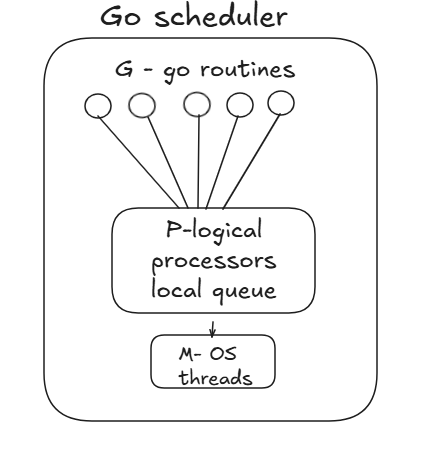

## Goroutines

## What is a goroutine?
- A lightweight thread managed by goruntime
- They start with ~2 KB stack and grow dynamically.
- Go can handle hundreds of thousands to millions of goroutines depending on memory.
- They are multiplexed over OS threads using the G-M-P scheduler.

-----------------------------

**What happens when a program starts?**
Step-by-step:

1. Go compiler builds a binary
2. OS loads it as a process
3. OS gives:
- Memory space
- At least 1 OS thread
4. Go runtime initializes
5. main.main() starts executing
- Go runtime sits between your code and the OS
-  It manages goroutines, scheduling, memory, GC
-----------------------------

## G-M-P scheduler model:
**G = Goroutine**
- Your lightweight task
- Starts with ~2 KB stack
- Can grow dynamically
- Managed by Go runtime

**M = Machine**
- Represents an OS thread
- Actually scheduled by OS
- Runs goroutines

**P = Processor**
- Logical processor
- Required to execute Go code
- Holds run queues of goroutines

By default = number of CPU cores.
Example:
If you have 8 cores → 8 P
---------------------------------

**How Many Goroutines Can Go Handle?**

Hundreds of thousands
Even millions

Why?
- Goroutine stack starts very small (~2 KB)
- OS thread stack is large (~1–2 MB)

1 million goroutines:
2 KB * 1,000,000 ≈ 2 GB memory

1 million OS threads?
Impossible.
-------------------------------

Go Runtime does:

1. Allocates a G struct
2. Places it in:
- Local run queue of P
OR
- Global run queue
- Scheduler picks it
- Assigns to an available M
- M executes it

-----------------------------

**Concurrency ≠ Parallelism**

- Concurrency = many tasks in progress.
GOMAXPROCS = 1
All goroutines run on 1 core (no parallelism)

- Parallelism = tasks running simultaneously on multiple cores
GOMAXPROCS = 8
Up to 8 goroutines can run truly in parallel.

**G → P → M → CPU core**
Go scheduler → manages G on M
OS scheduler → manages M on CPU cores

G (goroutines) are scheduled onto M through P.
- A P needs an M to execute.
- An M needs a P to run Go code.

GOMAXPROCS = number of P
P = logical execution slots inside Go runtime

By default = number of logical CPUs

---------------------------------
## Notes
- created using `go` keyword
- Non-blocking
- Runs concurrently

## Problem
If you remove time.Sleep(1 * time.Second) from main,
program exits before goroutine run

## Next Step
Use sync.WaitGroup to wait for goroutines.